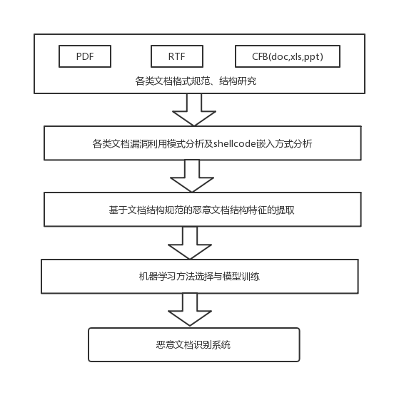
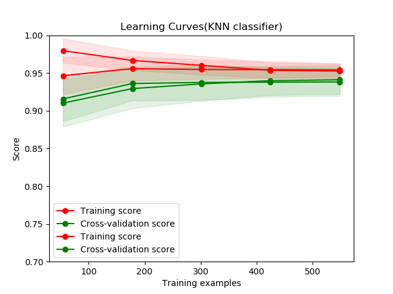
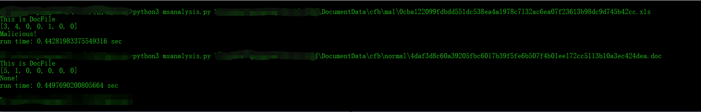

### 基于机器学习的恶意文档检测

#### 系统背景

网络钓鱼是一种利用社会工程学及科技手段来窃取受害者个人身份数据和账户信息的犯罪活动。根据反网络钓鱼工作组2016年第四季度的报告显示，2016年的钓鱼攻击次数相比2015年增长了65%，达到了1220523次，相比于2004年增长了5753%。网络钓鱼诈骗事件的增多在全球范围内导致了数十亿美金的损失。根据反网络钓鱼工作组(APWG)报告，钓鱼者最常用的钓鱼方式是电子邮件，即钓鱼邮件，所以针对钓鱼邮件的检测应成为防御社会工程学攻击的主要手段。

在经过大量调研后发现，鱼叉邮件普遍采用了社会工程学的伪装方法，精心构造邮件主题、邮件内容及附带的文档名，使其极具欺骗性、迷惑性，导致很多用户中招。且部分用户安全意识只停留在可执行的恶意程序上，对邮件中附带的恶意文档防范意识较弱。在鱼叉邮件攻击中，攻击者在邮件中最喜欢携带的文档为Office65.4%RTF36.3%

 2014年，日本国家警察局的 Otsubo团队再次把基于文档结构变化的恶意附件检测推向了技术高地。日本国家警察局团队在对恶意文档类文件进行检测时，提出了一个关键的思路，这个思路就是：文档类文件内的每一行代码，其意义就是让读者看到（即让阅读器去处理）。在恶意代码分析的过程中， 以读者的角度去观察整个文档的结构，存在变化，也就是说，有某些结构体的存在不让阅读器处理（由 shell处理），那么这个文档就可以判定为潜在恶意性文档。这个方法的提出，打破了早期基于文档结构变化的恶意文档检测方法中惯用的从表象去找静态特征的限制，创新性的以一种“以不变应万变”的思路来进行文档类恶意代码的检测。

这种方法的检测基准严格依照文档标准设定，无论恶意代码插入的手段如何变化，其检测标准都是与标准文件的偏差，误报率较低。

#### 系统实现

项目采用python的机器学习库：scikit-learn，主要用到训练集-验证集-测试集、交叉验证进行算法选择，运用网格搜索进行模型参数调整。模型持久化：Pikle

#### 系统效果

在目前实现了doc的检测

检测效果

#### TODO

* pdf类型文档的特征提取
* rtf类型文档的特征提取